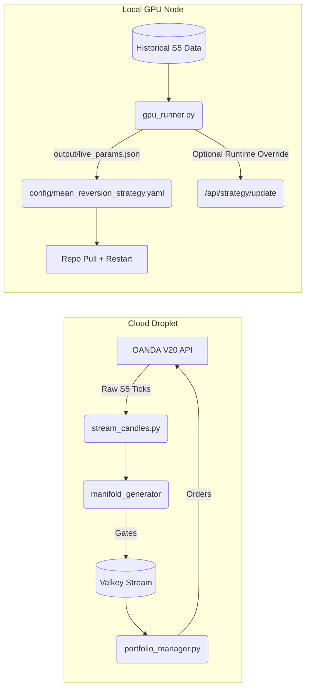

# System Architecture

The SEP Trader employs a distributed, signal-first, manifold-gate architecture. The codebase is strictly bifurcated into two environments: Live Cloud Execution and Local GPU Research.

## 1. High-Level Pipeline

### Execution Flow
1. **Ingest**: `scripts/tools/stream_candles.py` pulls raw S5 OHLC data from OANDA.
2. **Encoding**: The C++ executable `bin/manifold_generator` mathematically derives structural variance (Chaos, Entropy, Coherence) from the stream, producing "Gate" JSON payloads.
3. **Queue**: Gates are piped directly into Valkey (e.g., `gate:last:EUR_USD`).
4. **Scoring**: `PortfolioManager` reads the incoming gates and aligns them against the live configuration (`mean_reversion_strategy.yaml`).
5. **Execution**: If constraints pass, `risk_enforcer.py` sizes the position and `oanda.py` transmits the trade.

Persistent strategy promotion is repo-driven: the GPU node writes `output/live_params.json`, projects it into `config/mean_reversion_strategy.yaml`, and the droplet reloads that file via `./deploy.sh`. The webhook path is a runtime override only unless the live strategy path is writable and persistence is explicitly intended.

## 2. Trading Module Map (Execution Tier)

The live streaming daemon (`trading_service.py`) acts as the entrypoint for the OANDA connector, API, and the Portfolio Manager.

- `trading_service.py` (Daemon Bootstrap)
  - `scripts/trading/log_formatters.py` (Logging definition)
  - `scripts/trading/evidence_cache.py` (Historical regime context maps)
  - `scripts/trading/portfolio_manager.py` (Master logic router)
    - `scripts/trading/gate_loader.py` (Valkey sync)
    - `scripts/trading/circuit_breaker.py` (Equity limits switch)
    - `scripts/trading/risk_limits.py` (Exposure limits)
      - `scripts/trading/oanda.py` (API Gateway)
        - `scripts/trading/retry_utils.py` (Transient networking handling)

## 3. Simulator Architecture (Research Tier)

The offline research backtester processes massive historical TSV datasets to prove logic without risking live capital. It was explicitly refactored for complete decoupling from live dependencies.

- `scripts/research/simulator/backtest_simulator.py` (Primary simulation loop)
  - Tracks open simulated positions and resolves TP / SL exits incrementally bar-by-bar.
- `scripts/research/simulator/simulator_state.py`
  - Defines `TPSLSimulationParams` holding the current testing bounds parameter state.
- `scripts/research/data_store.py`
  - The single data adapter simulating live Valkey stream ingestion from static disk files.
- `scripts/research/simulator/signal_deriver.py`
  - Encapsulates exact match logic for how signals trigger, ensuring simulated entries identically match the live `PortfolioManager` filtering.

## 4. Environment Rules
1. **Never mock OANDA in Production**: Simulated data lives exclusively inside `scripts/research/`.
2. **No Heavy CPU Math Live**: `PortfolioManager` is an intentionally lightweight router. All heavy calculus occurs inside the C++ generator.
3. **No Stateful AI Live**: All strategy parameters and regimes are pre-computed offline by the GPU node and pushed up as static bounds.
4. **Deployment Contract Matters**: Exact live mirroring depends on the repo commit, the generated `config/mean_reversion_strategy.yaml`, and the backend env contract in `docker-compose.hotband.yml`, including `EXPOSURE_SCALE=0.02`, `PORTFOLIO_NAV_RISK_PCT=0.02`, `PM_MAX_PER_POS_PCT=0.02`, `PM_ALLOC_TOP_K=35`, `RISK_MAX_TOTAL_POSITIONS=35`, and `RISK_MAX_POSITIONS_PER_PAIR=5`.
