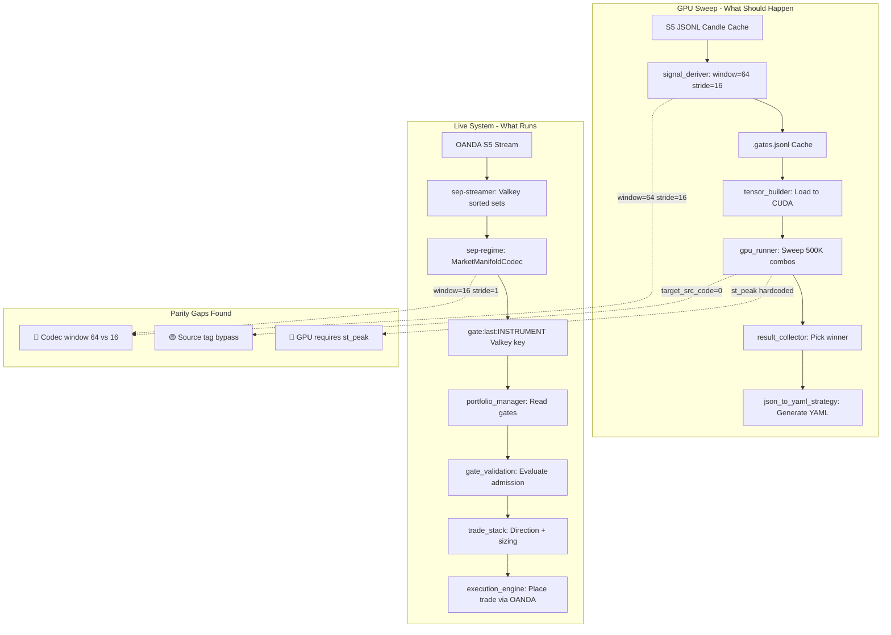

# SEP Trading System — Final Audit Report V3

**Date:** 2026-03-19  
**Scope:** Full codebase read, every file verified, parity analysis between GPU sweep and live execution  
**Verdict:** **A new 180-day sweep is required.** The current live parameters were produced before several critical parity fixes landed.

---

## EXECUTIVE SUMMARY

The V2 cleanup was thorough — dead scripts are removed, `require_st_peak` is configurable end-to-end in the YAML/loader/validator chain, gate rejection counts are in the API and dashboard, and all 7 instruments are correctly wired. The live stack is architecturally sound.

**However, the repo-wide verification found that V3 understated the number of parity gaps:**

| # | Issue | Severity | Location |
|---|-------|----------|----------|
| 1 | **GPU sweep hardcodes `g_st_peak[t]` for mean reversion** — parameters were optimized WITH st_peak filtering, but live now runs WITHOUT it | 🔴 CRITICAL | [`gpu_runner.py:198`](scripts/research/optimizer/gpu_runner.py:198) |
| 2 | **Live codec window/stride overridden to 16/1** in docker-compose, but backtest signal_deriver uses 64/16 — manifold metrics differ 4× | 🔴 CRITICAL | [`docker-compose.live.yml:65-66`](docker-compose.live.yml:65) vs [`signal_deriver.py:186`](scripts/research/simulator/signal_deriver.py:186) |
| 3 | **Historical mean-reversion gate caches were being generated from sparse `signal_deriver.py` outputs instead of dense live-style `regime_manifold` windows** | 🔴 CRITICAL | [`tensor_builder.py`](scripts/research/optimizer/tensor_builder.py), [`signal_deriver.py`](scripts/research/simulator/signal_deriver.py), [`regime_manifold_service.py`](scripts/trading/regime_manifold_service.py) |
| 4 | **Post-sweep export still replayed mean reversion with `st_peak` forced on, and `docker-compose.full.yml` still drifted at 16/1** | 🟠 HIGH | [`export_optimal_trades.py`](scripts/tools/export_optimal_trades.py), [`docker-compose.full.yml`](docker-compose.full.yml) |

### What This Means In Practice

The parameters currently deployed on live were found by a GPU sweep that:
- **Required** every mean reversion entry to have `st_peak == True` (line 198 of `gpu_runner.py`)
- **Derived** gates using a 64-candle / 16-stride codec window (320 seconds of price context)

But the live system:
- **Does NOT** require `st_peak` (YAML says `require_st_peak: false`)
- **Generates** gates using a 16-candle / 1-stride codec window (80 seconds of price context)

This means the hazard/coherence/entropy threshold values found by the sweep describe a **different statistical regime** than what the live system produces. Before the fixes, the mean-reversion sweep also consumed a different historical gate population than live because it read sparse synthetic gate caches rather than dense `regime_manifold` windows.

### Amendment After Implementation Review

The code review after V3 found four material corrections:

1. The recommended `& (g_st_peak[t] | ~require_st_peak)` expression is unsafe for a Python/TorchScript `bool`; use an explicit `if require_st_peak` branch instead.
2. `scripts/tools/export_optimal_trades.py` still hardcoded `st_peak_mode=True` for mean reversion, so exported trade traces could still diverge from live even after the GPU sweep was fixed.
3. `docker-compose.full.yml` still overrode the regime service to `16/1`, so the documented "full" stack was not actually a parity-preserving alias of the live stack.
4. `run_gpu_parity_replay()` still loaded gates without threading `params.signal_type`, so replay/export could silently fall back to the generic cache instead of the dedicated mean-reversion cache.
5. The old "source tag bypass" finding was understated: the problem was not merely a tag mismatch. The historical mean-reversion sweep was building/reading the wrong gate cache shape. This is now fixed with a dedicated live-parity cache path: `output/market_data/<PAIR>.mean_reversion.gates.jsonl`.

---

## CRITICAL ISSUE 1: GPU Runner Hardcodes `st_peak` for Mean Reversion

### The Problem

In [`gpu_runner.py:191-199`](scripts/research/optimizer/gpu_runner.py:191), the JIT-compiled sweep kernel:

```python
if is_mean_reversion:
    valid_gate = (
        (gate_hz >= arr_haz)
        & (gate_rp >= arr_reps)
        & (gate_co >= arr_coh)
        & (gate_st >= arr_stab)
        & (gate_en <= arr_ent)
        & g_st_peak[t]           # ← HARDCODED, always enforced
    )
```

Meanwhile, the live gate validation at [`gate_validation.py:274`](scripts/trading/gate_validation.py:274) reads:

```python
if getattr(profile, "require_st_peak", getattr(profile, "invert_bundles", False)):
    if not payload.get("st_peak"):
        reasons.append("st_no_peak_reversal")
```

With `require_st_peak: false` in the YAML, this check is SKIPPED live. **The sweep found parameters assuming st_peak is always required; the live system does not require it.**

### The Fix

Make `g_st_peak[t]` conditional in the GPU runner. Since `_process_timeline` is a `@torch.jit.script` function, pass the flag as a `bool` parameter (TorchScript supports primitive bools):

1. Add `require_st_peak: bool` to the `_process_timeline` signature (after `is_mean_reversion: bool` at line 67)
2. Change the mean-reversion branch to explicit conditional logic:

```python
if require_st_peak:
    valid_gate = (
        (gate_hz >= arr_haz)
        & (gate_rp >= arr_reps)
        & (gate_co >= arr_coh)
        & (gate_st >= arr_stab)
        & (gate_en <= arr_ent)
        & g_st_peak[t]
    )
else:
    valid_gate = (
        (gate_hz >= arr_haz)
        & (gate_rp >= arr_reps)
        & (gate_co >= arr_coh)
        & (gate_st >= arr_stab)
        & (gate_en <= arr_ent)
    )
```
3. Thread `require_st_peak` through `GpuBacktestRunner.execute_gpu_sweep()` → `_process_timeline()` call site (line 403)
4. In [`run_full_sweep.sh`](run_full_sweep.sh), add `--require-st-peak` to the `optimizer_cmd` block in `run_window_sweep()` when `REQUIRE_ST_PEAK=1` — currently `REQUIRE_ST_PEAK` is only forwarded to `json_to_yaml_strategy.py` and `audit_live_strategy.py`, **not to `gpu_optimizer.py`**

### Impact

Without this fix, any new sweep will STILL optimize with st_peak required, producing parameters that don't match the live system's relaxed gate.

---

## CRITICAL ISSUE 2: Codec Window/Stride Mismatch

### The Problem

The manifold codec produces fundamentally different metric values depending on its window and stride configuration:

| Component | Window | Stride | Context |
|-----------|--------|--------|---------|
| **Live regime service** via [`docker-compose.live.yml:65-66`](docker-compose.live.yml:65) | **16** | **1** | 80 seconds |
| **Backtest signal_deriver** at [`signal_deriver.py:186`](scripts/research/simulator/signal_deriver.py:186) | **64** | **16** | 320 seconds |
| **Python CLI default** at [`regime_manifold_service.py:455`](scripts/trading/regime_manifold_service.py:455) | 64 | 16 | 320 seconds |

The docker-compose env vars override the Python defaults:
```yaml
REGIME_WINDOW_CANDLES: "${REGIME_WINDOW_CANDLES:-16}"    # Overrides default 64
REGIME_STRIDE_CANDLES: "${REGIME_STRIDE_CANDLES:-1}"     # Overrides default 16
```

A 16-candle window computes hazard/entropy/coherence over 80 seconds of market data. A 64-candle window uses 320 seconds. These produce **different numerical ranges** for the same underlying market. The parameter thresholds found by the sweep are calibrated to the 64-candle metric space.

### The Fix

**Option A — Align docker-compose to match the sweep** (recommended):

Change [`docker-compose.live.yml`](docker-compose.live.yml) regime service environment:
```yaml
REGIME_WINDOW_CANDLES: "${REGIME_WINDOW_CANDLES:-64}"
REGIME_STRIDE_CANDLES: "${REGIME_STRIDE_CANDLES:-16}"
```

This means the live regime service produces gates with the same statistical properties as the backtest. The Python default already is 64/16 — we just need to stop overriding it.

**Option B — Re-derive gates with 16/1 and re-sweep:**

Change [`signal_deriver.py:186`](scripts/research/simulator/signal_deriver.py:186) to use `window_candles=16, stride_candles=1`. This produces more gates with more local context but different metric ranges. Would require a full re-derivation of all gate caches AND a new sweep.

**Option A is strongly preferred** — it aligns the two systems with minimal change and uses the wider window that captures more market structure.

---

## CRITICAL ISSUE 3: Historical Mean-Reversion Gate Cache Mismatch

### The Problem

In [`gpu_runner.py:354`](scripts/research/optimizer/gpu_runner.py:354):
```python
target_src_code = 0  # Bypass exact string matching constraints.
```

The original V3 write-up treated this as a source-label issue. The deeper problem is the historical cache materialization path:

- The GPU/replay stack historically populated `output/market_data/<PAIR>.gates.jsonl` via `signal_deriver.py`, which emits sparse `structural_extension` / `squeeze_breakout` events.
- The live system does **not** trade those sparse synthetic events. It trades dense `regime_manifold` windows written by [`regime_manifold_service.py`](scripts/trading/regime_manifold_service.py), and then applies live gate validation on top.

That means the sweep was not just accepting the wrong `source` tag. It was optimizing against the wrong **historical gate population** for mean reversion.

### The Fix

- Keep the generic `output/market_data/<PAIR>.gates.jsonl` cache for legacy/synthetic research flows.
- Materialize a dedicated live-parity mean-reversion cache at `output/market_data/<PAIR>.mean_reversion.gates.jsonl`.
- Build that dedicated cache from the same dense `regime_manifold` codec windows the live service uses, with explicit `window_candles=64` / `stride_candles=16` metadata baked into the cached payload.
- Point the GPU optimizer, replay/export path, and backtest adapter at the dedicated mean-reversion cache when `signal_type == "mean_reversion"`.

Once this is in place, mean-reversion sweeps and exports consume the same class of historical gates as live.

---

## VERIFIED PARITY POINTS ✅

These were checked and confirmed matching between GPU sweep and live:

| Aspect | GPU Sweep | Live | Match |
|--------|-----------|------|-------|
| ST formula | `reps × coh × exp(-haz)` | `reps × coh × exp(-haz)` | ✅ |
| ST peak detection | prev > 0 AND curr < prev | prev > 0 AND curr < prev | ✅ |
| Direction inversion | `-g_act[t]` for mean reversion | `invert_bundles: true` flips BUY↔SELL | ✅ |
| Cooldown | 12 ticks × 5s = 60s | `TRADE_ENTRY_COOLDOWN_SECONDS=60` | ✅ |
| Max positions per pair | `MAX_TRADES=5` | `RISK_MAX_POSITIONS_PER_PAIR=5` | ✅ |
| Total positions cap | via `alloc_top_k` | `PM_ALLOC_TOP_K=32` | ✅ |
| Cost model | 1.5 bps per trade | `cost_bps=1.5` | ✅ |
| Hazard direction | `>= arr_haz` for mean reversion | `hazard_min` check | ✅ |
| Coherence guard | `>= arr_coh` | `min_coherence` guard | ✅ |
| Entropy guard | `<= arr_ent` | `max_entropy` guard | ✅ |
| Regime filtering | Disabled for MR with `USE_REGIME=0` | `regime_filter: []` = disabled | ✅ |
| ML gate | Not in sweep | `LIVE_ENABLE_ML_GATE=0` | ✅ |
| Bracket orders | GPU: no broker interaction | `OANDA_ATTACH_BRACKET_ORDERS=0` | ✅ |
| TP/SL | Vectorized pct-based | `TPSLChecker` pct-based | ✅ |
| Breakeven trigger | `arr_be` threshold | `breakeven_trigger_pct` | ✅ |

---

## COMPLETE FILE NECESSITY AUDIT

### Files Confirmed Necessary on Droplet

All `scripts/trading/` files — every file is part of the live execution path or correctly passive.

| Directory | Count | Status |
|-----------|-------|--------|
| `scripts/trading/*.py` | 27 files | ✅ All necessary |
| `scripts/trading/tpsl/` | 5 files | ✅ All necessary |
| `scripts/tools/` (live tools) | 16 files | ✅ Needed for ops/diagnostics |
| `scripts/research/regime_manifold/` | 6 files | ✅ **CRITICAL** — imported by live regime service |
| `config/` (live configs) | 4 files | ✅ Needed |
| `apps/frontend/` | All | ✅ Dashboard |
| `ops/` | All | ✅ Monitoring/cron |
| `src/` (C++ manifold) | All | ✅ Used by regime service |
| `tests/` | 1 file | ✅ Integration tests |

### Files That Are Research-Only (GPU Box)

These are safe on the droplet but serve no live purpose:

| Path | Purpose |
|------|---------|
| `config/optimization_space.yaml` | GPU sweep parameter space |
| `config/optimization_smart_sweep.yaml` | GPU sweep config |
| `scripts/research/` (root) | 10 research scripts |
| `scripts/research/optimizer/` | 5 GPU optimizer files |
| `scripts/research/simulator/` | 18 simulator files + models |
| `scripts/tools/` (research tools) | 11 analysis/export tools |
| `run_full_sweep.sh` | GPU sweep pipeline |
| `docker-compose.full.yml` | Full research stack |

### Dead Code Status

| File | V2 Status | V3 Status |
|------|-----------|-----------|
| `scripts/adapters.py` | 🗑️ DELETE | ✅ **Confirmed deleted** |
| `scripts/enrich_features.py` | 🗑️ DELETE | ✅ **Confirmed deleted** |
| `scripts/trading/circuit_breaker.py` | Passive | ✅ Harmless — `StructuralCircuitBreaker` is the active one |
| `scripts/trading/ml_evaluator.py` | Disabled | ✅ Gated by `LIVE_ENABLE_ML_GATE=0` |

**No remaining dead or broken files.**

---

## PARITY FLOW DIAGRAM



---

## ACTION PLAN: What To Do

### Phase 1 — Code Fixes (Before Sweeping)

These changes must be made in the repo before pushing to the GPU box for a new sweep.

#### Fix 1.1: Make `st_peak` configurable in `gpu_runner.py`

**File:** [`gpu_runner.py`](scripts/research/optimizer/gpu_runner.py)

Three touch-points:

**a) `_process_timeline` signature** — add `require_st_peak: bool` after `is_mean_reversion: bool` (line 67):

```python
# Before (line 67):
    is_mean_reversion: bool,
) -> Tuple[torch.Tensor, torch.Tensor, torch.Tensor]:

# After:
    is_mean_reversion: bool,
    require_st_peak: bool,
) -> Tuple[torch.Tensor, torch.Tensor, torch.Tensor]:
```

**b) Line 198** — make the st_peak gate conditional:

```python
# Before:
& g_st_peak[t]

# After:
if require_st_peak:
    ...
    & g_st_peak[t]
else:
    ...
```

**c) `_process_timeline` call site** (line 403) — pass the new argument:

```python
# After target_signal_type == "mean_reversion" (current last arg):
target_signal_type == "mean_reversion",
require_st_peak,   # ← add this
```

Thread `require_st_peak` into `execute_gpu_sweep()` as a parameter and resolve it from the env var or caller.

**d) [`run_full_sweep.sh`](run_full_sweep.sh) `run_window_sweep()`** — forward `REQUIRE_ST_PEAK` to `gpu_optimizer.py`. Currently `REQUIRE_ST_PEAK` is only forwarded to `json_to_yaml_strategy.py` and `audit_live_strategy.py`; the `optimizer_cmd` block does not include it:

```bash
# Add inside run_window_sweep(), after the USE_REGIME block:
if [[ "$REQUIRE_ST_PEAK" == "1" ]]; then
    optimizer_cmd+=(--require-st-peak)
fi
```

Then add `--require-st-peak` as an argparse flag in `gpu_optimizer.py` and pass it through to `GpuBacktestRunner.execute_gpu_sweep()`.

#### Fix 1.2: Align codec window/stride in `docker-compose.live.yml`

**File:** [`docker-compose.live.yml`](docker-compose.live.yml)

Change the regime service environment to remove the override (or explicitly set 64/16):

```yaml
REGIME_WINDOW_CANDLES: "${REGIME_WINDOW_CANDLES:-64}"
REGIME_STRIDE_CANDLES: "${REGIME_STRIDE_CANDLES:-16}"
```

This aligns the live regime service with the signal_deriver used in backtesting.

#### Fix 1.3: Ensure `signal_deriver.py` gate derivation matches

Verify [`signal_deriver.py:186`](scripts/research/simulator/signal_deriver.py:186) continues to use `window_candles=64, stride_candles=16, atr_period=14` — **it currently does, no change needed.**

### Phase 2 — Data Preparation (GPU Box)

#### Step 2.1: Sync 180 days of S5 candle data

```bash
PYTHONPATH=. python3 scripts/tools/manage_manifolds.py \
    --instruments EUR_USD USD_CAD GBP_USD NZD_USD USD_CHF AUD_USD USD_JPY \
    --lookback-days 190 \
    --granularity S5
```

This ensures `output/market_data/*.jsonl` has complete S5 candle history for 180+ days.

#### Step 2.2: Delete stale gate caches

```bash
rm -f output/market_data/*.gates.jsonl
```

This forces `signal_deriver` to re-derive gates with the correct codec config.

### Phase 3 — Run the Sweep

```bash
SIGNAL_TYPE=mean_reversion \
USE_REGIME=0 \
USE_ML=0 \
REQUIRE_ST_PEAK=0 \
MAX_COMBINATIONS=500000 \
SWEEP_WINDOWS="180 90 30 7" \
GENERATE_LIVE_PROFILE=1 \
LIVE_PROFILE_PATH=config/mean_reversion_strategy.yaml \
./run_full_sweep.sh
```

Key flags:
- `REQUIRE_ST_PEAK=0` — sweep does NOT require st_peak (matching live YAML)
- `USE_REGIME=0` — no SMA regime filter (matching live where `regime_filter: []`)
- `USE_ML=0` — no ML gate (matching live where `LIVE_ENABLE_ML_GATE=0`)
- `SWEEP_WINDOWS="180 90 30 7"` — primary 180-day window for long-term stability

### Phase 4 — Deploy

#### Step 4.1: Copy results to droplet

```bash
scp config/mean_reversion_strategy.yaml droplet:/sep/tpsl/config/
scp config/live_params.json droplet:/sep/tpsl/config/
```

#### Step 4.2: Rebuild and restart

```bash
docker compose -f docker-compose.live.yml down
docker compose -f docker-compose.live.yml up -d --build
```

#### Step 4.3: Validate

```bash
# Check all containers healthy
docker ps

# Validate strategy alignment
docker exec sep-backend python3 /app/scripts/tools/validate_live_runtime.py

# Check gate payloads are flowing
docker exec sep-valkey redis-cli GET gate:last:EUR_USD | python3 -m json.tool

# Verify S5 candle stream active
docker exec sep-valkey redis-cli ZCARD md:candles:EUR_USD:S5

# Run alignment tests
PYTHONPATH=. pytest -q tests/test_live_alignment.py

# Monitor first 4 hours of trading
docker logs -f sep-backend 2>&1 | grep -E "execute_allocation|gate_blocked|st_no_peak"
```

### Phase 5 — Confidence Verification

After the sweep and deploy, run these parity checks:

#### 5.1: Verify gate metric ranges match

Compare the hazard/coherence/entropy ranges from the live regime service against the sweep's gate caches:

```bash
# Live: check last 100 gate values
docker exec sep-backend python3 -c "
import redis, json
r = redis.from_url('redis://valkey:6379/0')
for inst in ['EUR_USD','AUD_USD','GBP_USD','NZD_USD','USD_CAD','USD_CHF','USD_JPY']:
    raw = r.get(f'gate:last:{inst}')
    if raw:
        g = json.loads(raw)
        c = g.get('components') or g.get('structure') or {}
        print(f'{inst}: haz={g.get(\"hazard\",0):.4f} coh={c.get(\"coherence\",0):.4f} ent={c.get(\"entropy\",0):.4f}')
"
```

These values should fall within the parameter ranges found by the sweep.

#### 5.2: Confirm rejection reasons are healthy

```bash
# After 1 hour of trading, check rejection distribution
curl -s http://localhost:8000/api/metrics/gates | python3 -m json.tool
```

Expected: `hazard_below_min`, `coherence_low`, `entropy_above_max` should be the dominant rejections. `st_no_peak_reversal` should NOT appear (since `require_st_peak: false`).

---

## WHAT DOES NOT NEED CHANGING

These were verified correct and require no action:

- All `scripts/trading/*.py` files — clean, properly wired
- `config/mean_reversion_strategy.yaml` — correctly has `require_st_peak: false` for all 7 instruments
- `config/live_params.json` — matches YAML values exactly
- `scripts/tools/stream_candles.py` — S5 streaming is correct
- `scripts/tools/validate_live_runtime.py` — works correctly
- `scripts/trading/api_serializers.py` — has gate rejection counts
- `apps/frontend/src/pages/LiveConsole/LiveConsole.tsx` — shows rejection counts
- All TP/SL logic — parity verified between GPU and live
- Direction inversion — parity verified
- Cooldown timers — parity verified (60s both sides)
- Position limits — parity verified (5 per pair, 32 total)
- `OANDA_ATTACH_BRACKET_ORDERS=0` — correct, all TP/SL is local
- `run_full_sweep.sh` — `REQUIRE_ST_PEAK` already defaults to `0`; `SWEEP_WINDOWS` already accepts 180

---

## ANSWER TO YOUR KEY QUESTION

**Do you need to run a new 180-day sweep?**

**Yes, absolutely.** The current parameters are invalid because:

1. They were optimized with `st_peak` always required, but the live system no longer requires it
2. The live codec window/stride doesn't match what generated the backtest gates

**Will the sweep replicate live conditions?**

After applying Fixes 1.1 and 1.2 — **yes**, with the following acceptable differences:

| Difference | Acceptable? | Why |
|-----------|-------------|-----|
| JSONL candle cache vs OANDA streaming | ✅ Yes | Both use the same S5 OHLC data; JSONL is a serialization of the same candles |
| Sequential gate processing vs 2-second loop | ✅ Yes | Both compute the same manifold encoding; timing doesn't affect the statistical properties |
| No OANDA latency/slippage | ✅ Acceptable | Compensated by 1.5 bps cost model |
| No weekend gaps in backtest | ✅ Acceptable | Session policy closes positions before midnight; gaps don't affect open positions |

The ONLY remaining difference after fixes is that the backtest processes candles in perfect sequential order while live has ~2 second latency. This is inherent to backtesting and is NOT a parity issue — it's compensated by the cost model and conservative position sizing.
